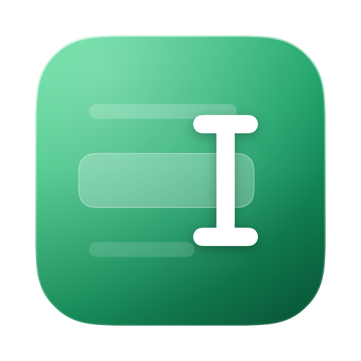

# Internalize

**A native Mac PDF reader where you converse with what you're reading, on the ChatGPT plan you already have.**

Select a passage, capture a diagram, ask anything. Every answer is anchored to the page.
No API keys, no subscription, no servers. Free.

### [⬇ Download the latest version](https://github.com/seyeint/internalize-releases/releases/latest) · [getinternalize.com](https://getinternalize.com)

---

## Requirements

- **macOS 15** or newer (Apple Silicon and Intel)
- The **[ChatGPT app for Mac](https://learn.chatgpt.com/codex/app)**, signed in with your ChatGPT account. Codex ships inside it, and Internalize runs its AI through Codex on *your* plan, which is why it's free and needs no API key

## Install

1. Download the DMG above and open it
2. Drag **Internalize** into **Applications**
3. Launch, drop a PDF on the welcome screen, and start asking

The app is signed and notarized by Apple, so it opens without warnings. Updates are automatic: when a new version ships, Internalize offers to install it in one click (or check manually via **Internalize ▸ Check for Updates…**).

## Features

- 📄 Native PDF reading with per-document zoom, ⌘F search, and drag-and-drop import
- 🤖 Streamed AI conversations grounded in your selection, your pages, or the whole document
- 🔗 Page references in answers are links: click "p. 12" and you're there
- ✍️ Area capture for diagrams and equations (vision)
- 🗂️ A project hub where every project wears its document's title page
- 🗺️ Document map: every annotation anchored to its exact place, plus reading progress
- ⏱️ Focus timer with a reading activity dashboard: heatmap, streaks, time by project
- 📊 Your ChatGPT plan usage, right in the chat footer
- 🎙️ Voice: dictate questions, hear answers read aloud
- 📤 Export any conversation to Markdown

## Privacy and security model

Internalize is built local-first and is honest about what it touches:

- **Your documents and conversations never leave your Mac** except as AI requests through your own Codex installation, the same path as chatting in the ChatGPT app itself
- **No telemetry, no analytics, no accounts, no servers operated by us**
- Codex runs in an **isolated, read-only profile** with browser, computer, app, plugin, and multi-agent capabilities switched off: Internalize can ask it questions and nothing else, and your personal Codex configuration is never loaded
- Your ChatGPT credentials are **never handled by Internalize**. Sign-in happens in the ChatGPT app; verify all of this with any network monitor

## Support

Internalize is free and built by one person. If it makes your reading life better, you can [**buy me a coffee on Ko-fi** ☕](https://ko-fi.com/internalize). Tips keep the app free for everyone.

---

*Issues and feature requests: open one [here](https://github.com/seyeint/internalize-releases/issues).*
